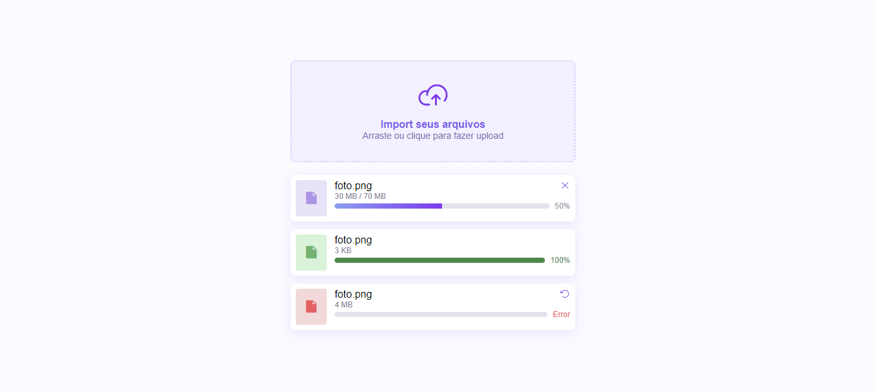

<p align="center">
  <a href="#-tecnologias">Tecnologias</a>&nbsp;&nbsp;&nbsp;|&nbsp;&nbsp;&nbsp;
  <a href="#-projeto">Projeto</a>&nbsp;&nbsp;&nbsp;|&nbsp;&nbsp;&nbsp;
  <a href="#-layout">Layout</a>&nbsp;&nbsp;&nbsp;|&nbsp;&nbsp;&nbsp;
  <a href="#-como-executar">Como executar</a>&nbsp;&nbsp;&nbsp;|&nbsp;&nbsp;&nbsp;
</p>
<br>

## ✨ Tecnologias

Esse projeto foi desenvolvido com as seguintes tecnologias:

- HTML
- CSS
- [JavaScript](https://www.javascript.com/)
- [Phosphor Icons](https://phosphoricons.com/)

## 💻 Projeto

Desafio de um componente de upload, geralmente encontrado em sites que o usuário precisa mandar um arquivo, do programa [boracodar](https://www.rocketseat.com.br/boracodar) da Rocketseat. 

## 🔖 Layout
<p align="center">
  
</p>

## 🚀 Como executar
```bash
# Clone o repositório do projeto
$ git clone https://github.com/carlosdaniel31/upload-component.git

# Com a pasta aberta em seu editor de código execute o arquivo index.html
